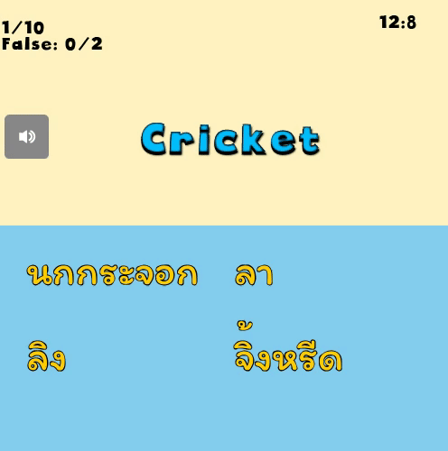

# Vocab-Game เกมส์ทายความหมายศัพท์ภาษาอังกฤษ
## เริ่มเกม
###### หลังจากกด Start มาแล้วจะมีหมวดหมู่คำศัพท์ให้เราเลือกเล่น ให้เราเลือกหมวดใดหมวดหนึ่งเพื่อเล่นเกมส์

  

###### ถ้าตอบถูกจะขึ้นหน้าต่างแสดงว่า Correct ให้เรากด OK เพื่อไปข้อต่อไป 

  

###### ถ้าตอบผิดจะขึ้น Wrong ให้กด OK เพื่อเล่นข้อถัดไป 

  

 
###### Timeout 

  

###### ถ้าตอบผิดเกินที่ตั้งค่าไว้ เกมส์จะจบทันทีพร้อมเฉลยข้อที่ทายผิด เราสามมารถเลือกกดเกมส์เพื่อเล่นอีกครั้ง หรือกดออกจากเกมส์เมื่อเลิกเล่นแล ้ว 

  

###### การตั้งค่า

  

